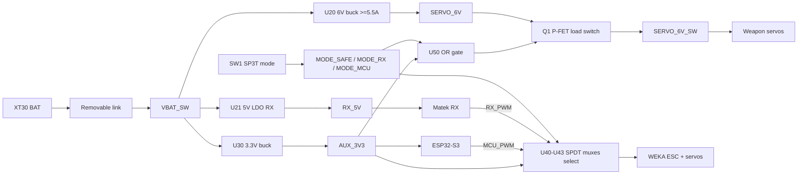

# Flipping Cool Rev B - Complete Schematic and Print-Ready PCB

## Scope and outcome

- A real KiCad Rev B schematic at `bots/flipping-cool/pcb/flipping-cool.kicad_sch` and child sheets, replacing the Rev A historical content.
- A PCB derived from that schematic at `bots/flipping-cool/pcb/flipping-cool.kicad_pcb` (~120 x 100 mm, 4 layers, ESP32 antenna keep-out preserved).
- ERC = 0 errors / 0 required warnings, DRC = 0 errors, 0 required unconnected nets.
- Regenerated fab outputs in `bots/flipping-cool/pcb/fab_rev_b/` and updated docs.

## Power and control architecture (the contract)

Truth table baked into hardware:

- `SAFE`: `MODE_SAFE = H`, others `L`. `U50 = L` -> `Q1` open -> `SERVO_6V_SW` dead -> servos de-energized. Mux SEL = `L` so muxes default to RX side. Receiver and MCU both stay alive (RX_5V and AUX_3V3 are sourced from VBAT_SW, independent of U20).
- `RX_DIRECT`: `MODE_RX = H`. `U50 = H` -> `Q1` closed -> servos powered. Mux SEL = `L` -> RX path. Works with MCU unpowered because mux Vcc = AUX_3V3 (independent of MCU) and mux SEL is pulled low by SW1, not driven by MCU.
- `MCU_CONTROL`: `MODE_MCU = H`. `U50 = H` -> servos powered. Mux SEL = `H` -> MCU path. ESP32-S3 owns PWM and may use BLE.
- 100k pull-downs on each `MODE_*` net guarantee defined logic during switch transit.

## Concrete part choices

- `U10` ESP32-S3-WROOM-1 (Espressif module, KiCad `RF_Module:ESP32-S3-WROOM-1`). Use the official symbol from `RF_Module.kicad_sym`. Correct pin map (IO0 = pin 27, EN = pin 3, UART0 TXD = pin 37, RXD = pin 38, GND on pins 1/40/41 and exposed pad). Native USB on IO19/IO20 to a USB-C connector.
- `U20` 6V SERVO buck: Pololu D36V50F6 module on a real 6-pin THT landing (existing `custom:Pololu_D36V50F6_BEC` symbol; `Connector_PinHeader_2.54mm:PinHeader_1x06_P2.54mm_Vertical` or solder-wire pads). Pre-validated 5.5A, removes buck-IC layout risk for v1. Discrete IC swap is a Rev C task.
- `U21` RX 5V LDO: AP2114H-5.0 or AMS1117-5.0 (SOT-223, 1A, ~1V dropout). Powers Matek receiver from VBAT_SW so RX stays alive when SERVO_6V is cut in SAFE.
- `U30` 3.3V buck: MP2315 (SOIC-8-EP, 3A, 4.5-24V Vin). 500 mA Pololu D24V5F3 was marginal with Wi-Fi; MP2315 gives headroom and is on-board (max-integration intent).
- `Q1` SERVO load switch: SI2333DDS-T1-GE3 P-MOS (SOT-23, 4.2A, 30V) with 100k gate pull-up to SERVO_6V and 2N7002 driver from `U50` output. Soft-start cap on gate.
- `U40-U43` PWM source muxes: 4x 74LVC1G3157DBV (SOT-23-6, 0.7 ohm Ron, 5V tolerant). Pinout: `1=B1, 2=GND, 3=A, 4=B2, 5=S, 6=Vcc`. Wire `B1=RX_PWM_*`, `B2=MCU_PWM_*`, `A=PWM_OUT_*`, `S=MODE_MCU`, `Vcc=AUX_3V3`.
- `U50` mode-OR: SN74LVC1G32DBV (SOT-23-5).
- `SW1` mode switch: 4-pin SP3T (`Button_Switch_SMD:SW_SP3T_PCM13`) with common = AUX_3V3, throws = MODE_SAFE/RX/MCU, plus 3x 100k pull-downs.
- `SW2` reset, `SW3` boot: SMD tact buttons (`SW_SPST_TL3305B`).
- `D1` TVS: SMBJ12CA (12V working, 13.3V breakdown) on VBAT_SW. Standardize on this; remove the Rev A SMAJ15CA spec drift.
- `F1` PTC fuse: 500 mA on the AUX_3V3 buck input only (existing).
- `J1`-`J5`, `J10`-`J11`, `J20`-`J33`: existing Rev A connector choices preserved (XT30, JST-XH, JST-SH, 0.1" headers).
- USB programming: USB-C receptacle (`Connector_USB:USB_C_Receptacle_GCT_USB4085`) to ESP32-S3 native USB. ESD via USBLC6-2SC6.
- Status LEDs `D50/D51/D52`: existing 0805 LEDs, common-anode through 330R series, MCU sinks.
- ADC dividers `R40/R41`, `R42/R43`, `R44/R45`: 100k/47k unchanged. Add 1nF cap to GND on each ADC tap.
- I2C `J49`: STEMMA QT (`Connector_JST:JST_SH_SM04B-SRSS-TB`), `R46/R47` 4.7k pull-ups (DNP).

## Schematic file plan

I'll author seven hierarchical sheets under [bots/flipping-cool/pcb/](bots/flipping-cool/pcb/). The root [flipping-cool.kicad_sch](bots/flipping-cool/pcb/flipping-cool.kicad_sch) becomes a Rev B block-diagram parent.

- [00_system_overview.kicad_sch](bots/flipping-cool/pcb/00_system_overview.kicad_sch) - block diagram, power tree, control truth table, off-board boundary.
- [01_battery_safety.kicad_sch](bots/flipping-cool/pcb/01_battery_safety.kicad_sch) - J1 XT30, J2 link, J3 LED + R1, J4 balance sense, F1 PTC (3.3V buck only), D1 TVS (SMBJ12CA), C1 470uF, C2 10uF on VBAT_SW.
- [02_power_rails.kicad_sch](bots/flipping-cool/pcb/02_power_rails.kicad_sch) - U20 D36V50F6 6V buck, U21 AP2114H 5V LDO for RX, U30 MP2315 3.3V buck with full feedback/cap network, Q1 + 2N7002 + R-network + soft-start cap forming the SERVO_6V_SW load switch driven by U50.
- [03_receiver_pwm.kicad_sch](bots/flipping-cool/pcb/03_receiver_pwm.kicad_sch) - J10 Matek ELRS PWM (RX_5V powered), J11 CRSF UART (JST-SH), J11b VBAT telemetry sense pad.
- [04_drive_esc_motors.kicad_sch](bots/flipping-cool/pcb/04_drive_esc_motors.kicad_sch) - J20 WEKA XT30 power, J21 WEKA PWM, J22 motor solder pads (4 wires), or J23-J26 per-motor pairs; left/right paralleled.
- [05_authority_and_servos.kicad_sch](bots/flipping-cool/pcb/05_authority_and_servos.kicad_sch) - SW1 SP3T with pull-downs, U40-U43 four 74LVC1G3157 muxes wired per truth table, U50 OR gate, J30/J31 weapon servo headers (SERVO_6V_SW), J32/J33 spare PWM headers.
- [06_mcu_io_and_debug.kicad_sch](bots/flipping-cool/pcb/06_mcu_io_and_debug.kicad_sch) - U10 ESP32-S3-WROOM-1 with correct pin map, decoupling (100nF per VDD pin + 10uF bulk), R10 EN pull-up, R11 BOOT pull-up, SW2 reset, SW3 boot, USB-C with ESD diodes, J12 UART program header (auto-reset/boot fallback), R40-R47 ADC dividers + 1nF caps, R46/R47 I2C pull-ups (DNP), J49 STEMMA QT, status LED net (D50-D52 + R50-R52), J44/J46-J48 debug headers.

I'll add a power/control truth-table text block on sheet 00, including the receiver-priority guarantee and the MODE pull-down note, so the design contract lives next to the schematic.

## ESP32-S3 GPIO assignment (final)

I'll fix the broken pin map from `build_rev_b_pcb.py`. Strap pins respected:

- IO0 (pin 27) -> ESP_BOOT (with R11 10k pull-up, SW3 to GND)
- EN (pin 3) -> ESP_EN (with R10 10k pull-up, SW2 to GND, 1uF to GND)
- IO45/46 (strap, leave at default) -> NC or low-impact signals only
- IO19/20 -> USB D-/D+
- IO37 (TXD0) / IO38 (RXD0) -> J12 program header
- IO4-IO7 -> MCU_PWM_DRIVE_LEFT/RIGHT, MCU_PWM_WEAPON_FR/LR
- IO8/IO9 -> I2C SDA/SCL (default safe pins for I2C)
- IO10/IO11/IO12 -> STATUS_LED_R/G/B_N (active low)
- IO15/IO16/IO17 -> CRSF_RX, CRSF_TX, NC
- IO1/IO2/IO3 (ADC1) -> ADC_VBAT, ADC_SERVO_6V, ADC_RX_5V
- IO13/IO14 -> MODE_SAFE_SENSE, MODE_RX_SENSE (MCU can read switch state for telemetry; mux is still controlled by hardware MODE_MCU)
- GND on pins 1, 40, 41 + exposed pad

This will be in a comment block on sheet 06 for review before I commit.

## PCB sync and routing

1. Full-rebuild: delete all auto-generated tracks/vias/zones in [flipping-cool.kicad_pcb](bots/flipping-cool/pcb/flipping-cool.kicad_pcb), keep only the board outline (120 x 100 mm) and ESP32 antenna keep-out polygon. Re-link to the new schematic so the netlist drives placement.
2. Hand-place by zone: battery/link/TVS in the lower-left high-current zone; U20/U21/U30 in the lower-middle power zone; SW1 + muxes + Q1 in the center mode-switch zone; ESP32-S3 + USB-C + buttons in the upper-right MCU zone with the antenna at the top edge; J10 receiver + J11 CRSF on the right edge; J20-J33 connectors along the periphery in the same orientation as the existing fab; debug headers and TPs on the bottom edge.
3. Layer stack: F.Cu signal, In1.Cu solid GND_PWR plane, In2.Cu power (VBAT_SW + SERVO_6V_SW split pour), B.Cu signal/secondary GND.
4. High-current rails: VBAT_SW and SERVO_6V_SW as F.Cu pours with In2.Cu shadow; >=2 mm equivalent width up to the WEKA XT30; 4-via stitches on every regulator pad transition.
5. Replace the broken A* router in [build_rev_b_pcb.py](bots/flipping-cool/pcb/build_rev_b_pcb.py) with a hand-route plan plus Freerouting via the configured KiCad MCP (`tools/KiCAD-MCP-Server`). Hand-route power, USB diff-pair (90 ohm), and ESP32 strap traces; let Freerouting handle the rest.
6. Antenna keep-out: enforce no copper any layer in the 7 x 15 mm rectangle above U10's antenna; checked with a custom KiCad DRU rule in [flipping-cool.kicad_dru](bots/flipping-cool/pcb/flipping-cool.kicad_dru) if needed.
7. Silkscreen: clear `SAFE | RX | MCU` mode labels next to SW1, polarity markers on XT30/JST/servo headers, "MCU FAILSAFE: RX_DIRECT BYPASSES MCU" warning, "ESP32 ANTENNA KEEPOUT" mark, board rev and project name.
8. Iterate ERC and DRC. Acceptance: `kicad-cli sch erc` reports `0 Errors 0 Warnings` and `kicad-cli pcb drc` reports `0 violations` and `0 unconnected items` (or only documented allow-list).
9. Regenerate fab: rerun the fab portion of [build_rev_b_pcb.py](bots/flipping-cool/pcb/build_rev_b_pcb.py) (Gerbers, drill, pos CSV, STEP, renders, ZIP) into `fab_rev_b/`.

## Doc updates

- [docs/rev_b_architecture.md](bots/flipping-cool/docs/rev_b_architecture.md): replace power tree to show RX_5V independent of SERVO_6V, add the SAFE-cuts-servo-rail truth table, add MODE pull-down note, add ESP32-S3 GPIO map.
- [docs/BOM.md](bots/flipping-cool/docs/BOM.md): replace `U20` 6V buck row with Pololu D36V50F6 module, add U21 AP2114H-5.0, replace U30 with MP2315, add Q1 + 2N7002, U40-U43 74LVC1G3157, U50 SN74LVC1G32, USB-C receptacle, USBLC6-2SC6 ESD.
- [docs/electrical-growth.md](bots/flipping-cool/docs/electrical-growth.md): annotate "Rev B implemented" markers, add Rev C parking lot (discrete 6V buck IC, brushless drive option, etc.).
- [pcb/README.md](bots/flipping-cool/pcb/README.md): drop the "Rev A historical sheets" framing, document Rev B schematic-first workflow, list the seven sheets.

## Acceptance gate before fab

I will not regenerate `fab_rev_b/` or write a "ready to order" note until all of:

- [ ] ERC passes with zero errors/warnings on the new Rev B schematic
- [ ] DRC passes with zero errors and zero required-net unconnected items
- [ ] Annotation is complete (no `?` references)
- [ ] BOM CSV exports cleanly and matches the schematic
- [ ] Antenna keep-out is empty on every layer
- [ ] All four MODE truth-table states verified by inspecting net connectivity (script-driven sanity check)

## Risks I am accepting in this plan

- Pololu D36V50F6 stays a module rather than a discrete buck IC. Trades a few grams and ~17 x 12 mm vertical real estate for v1 schedule safety; flagged for Rev C.
- 120 x 100 mm board does not fit the 1-lb chamfered-square chassis. You explicitly chose to keep this size for bench/dev; bot-fit is a Rev C task.
- USB-C with native ESP32-S3 USB has no UART fallback bridge IC. `J12` 0.1" header preserves an external UART path if the native USB stack ever misbehaves.

## Out of scope for this pass

- Mechanical CAD changes in [bots/flipping-cool/cad/](bots/flipping-cool/cad/).
- Firmware in [bots/flipping-cool/firmware/](bots/flipping-cool/firmware/).
- Brushless drive option, current sensing, or smart-fuse e-fuse controllers - parked for Rev C.